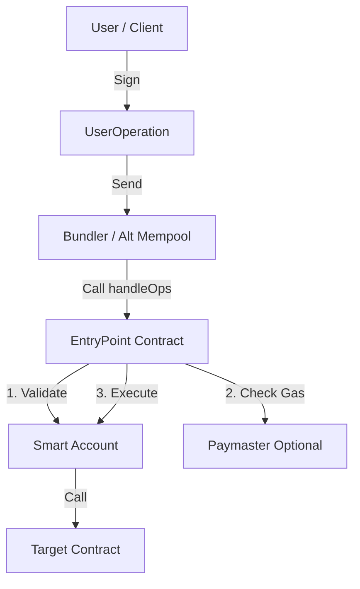

<div align="center">

# 🛡️ ERC-4337 Account Abstraction – Foundry

<p align="center">
  <strong>A production-ready, protocol-accurate implementation of ERC-4337 Account Abstraction.</strong>
  <br />
  Built with Foundry · Focused on internals · Real execution flow
</p>

<br/>
</div>

## 📑 Table of Contents

- [🧠 Overview](#-overview)
- [📚 What is Account Abstraction?](#-what-is-account-abstraction)
- [⚙️ Why ERC-4337?](#-why-erc-4337)
- [🏗️ Architecture & Flow](#-architecture--flow)
- [📂 Project Structure](#-project-structure)
- [🧩 Key Components](#-key-components)
  - [SmartAccount](#smartaccount)
  - [Session Keys](#session-keys)
  - [Paymaster](#paymaster)
- [🚀 Usage & Scripts](#-usage--scripts)
- [🛠️ Tooling & References](#-tooling--references)
- [⚠️ Disclaimer](#-disclaimer)

---

## 🧠 Overview

This repository contains a **from-scratch ERC-4337 Account Abstraction implementation** designed to expose how the protocol works internally.

The goal is **not SDK abstraction**, but a deep dive into:
- 📦 **UserOperation** construction and packing.
- 🔐 **Smart account validation** logic.
- 🔄 **EntryPoint** execution flow.
- ⛽ **Gas sponsorship** via Paymasters.
- 🔑 **Session-based** authorization.

This project mirrors how **bundlers and wallets** interact with ERC-4337 on production networks using `v0.7` standards.

---

## 📚 What is Account Abstraction?

In traditional Ethereum, Externally Owned Accounts (EOAs) are rigid. **Account Abstraction (AA)** moves authorization and validation logic from the protocol level into smart contracts.

| Feature | Traditional EOA | Smart Account (AA) |
| :--- | :--- | :--- |
| **Control** | Single Private Key | Arbitrary Logic (Multi-sig, Social Recovery) |
| **Gas Payment** | ETH only | ETH, ERC-20, or Sponsored (Gasless) |
| **Security** | Seed Phrase Risk | Session Keys, Spending Limits |
| **Upgradability** | Impossible | Possible (via Proxies) |

### What does this repo show?
1. A minimal EVM **"Smart Wallet"** using the `EntryPoint` contract.
2. Handling `validateUserOp` manually.
3. Integration with **Paymasters** for gas sponsorship.

---

## ⚙️ Why ERC-4337?

ERC-4337 is the industry standard for Account Abstraction because it achieves AA **without modifying the Ethereum consensus layer** (no hard fork required).

- **Alternative Mempool:** UserOps are sent to a separate mempool.
- **Bundlers:** Special nodes bundle UserOps into standard Ethereum transactions.
- **EntryPoint:** A singleton contract that coordinates validation and execution.

---

## 🏗️ Architecture & Flow

The flow of a transaction in this repository follows the standard ERC-4337 lifecycle.



---

## 📂 Project Structure

A clean, modular structure following Foundry best practices.

```text
src/
├── account/
│   ├── SmartAccount.sol        # Core ERC-4337 wallet logic
│   └── SessionKeyManager.sol   # Module for delegated session keys
├── paymaster/
│   └── SimplePaymaster.sol     # Gas sponsorship logic
├── utils/
│   └── SignatureUtils.sol      # ECDSA recovery helpers
└── interfaces/                 # IAccount, IPaymaster, IEntryPoint
script/
├── DeploySmartAccount.s.sol    # Deployment logic
├── DeploySimplePaymaster.s.sol # Paymaster setup
├── EnableSessionKey.s.sol      # Session key registration
└── SendUserOp.s.sol            # UserOp construction & transmission

```

---

## 🧩 Key Components

### SmartAccount

`SmartAccount.sol` implements the `IAccount` interface. It is responsible for:

1. **Nonce Management:** Preventing replay attacks.
2. **Signature Validation:** Verifying the signer matches the owner (or a valid session key).
3. **Execution:** Calling the target contract if validation passes.

### Session Keys

Implemented in `SessionKeyManager.sol`. Session keys allow users to generate a temporary key with **restricted permissions** (e.g., "Can only interact with Uniswap for the next 2 hours"). This improves UX by removing the need for constant wallet pop-ups.

### Paymaster

`SimplePaymaster.sol` implements the `IPaymaster` interface.

* **Purpose:** Decouples the sender from the gas payer.
* **Mechanism:** The Paymaster deposits ETH into the EntryPoint. When a UserOp is executed, the EntryPoint deducts gas costs from the Paymaster's balance instead of the Smart Account.

---

## 🚀 Usage & Scripts

This project uses **Foundry** for all deployments and simulations.

### Prerequisites

* [Foundry](https://github.com/foundry-rs/foundry)
* [Git](https://git-scm.com/)

### Installation

```bash
git clone [https://github.com/NexTechArchitect/ERC4337-Account-Abstraction-Foundry.git](https://github.com/NexTechArchitect/ERC4337-Account-Abstraction-Foundry.git)
cd ERC4337-Account-Abstraction-Foundry
forge install

```

### Build & Test

```bash
forge build
forge test

```

### Deployment & Execution

We use Solidity scripts to simulate the Bundler behavior.

| Command | Description |
| --- | --- |
| `make deploy` | Deploys contracts and runs the full flow. |
| `make fix` | Retries the transaction using existing contracts (Saves Gas). |
| `make balance` | Checks the wallet balance. |

---

## 🛠️ Tooling & References

The following tools and standards were used to build this project:

* **[Foundry](https://book.getfoundry.sh/)**: Blazing fast, portable and modular toolkit for Ethereum application development.
* **[ERC-4337 Standard](https://eips.ethereum.org/EIPS/eip-4337)**: The official Ethereum Improvement Proposal specification.
* **[Eth-Infinitism](https://github.com/eth-infinitism/account-abstraction)**: The reference implementation of the EntryPoint.
* **[OpenZeppelin](https://docs.openzeppelin.com/)**: Standard cryptographic utilities (ECDSA, MessageHashUtils).

---

## ⚠️ Disclaimer

This repository is intended for **educational purposes and protocol exploration**.
While it implements core ERC-4337 features, it has not been formally audited. Do not use this exact code in production without a thorough security review.

---

<div align="center">
<b>Built with ❤️ by NEXTECHARHITECT</b>


<i>Smart Contract Developer · Solidity · Foundry · Web3 Engineering</i>


<a href="https://www.google.com/search?q=https://github.com/NexTechArchitect">GitHub</a> •
<a href="https://www.google.com/search?q=https://twitter.com/NexTechArchitect">Twitter</a>
</div>

```

```
